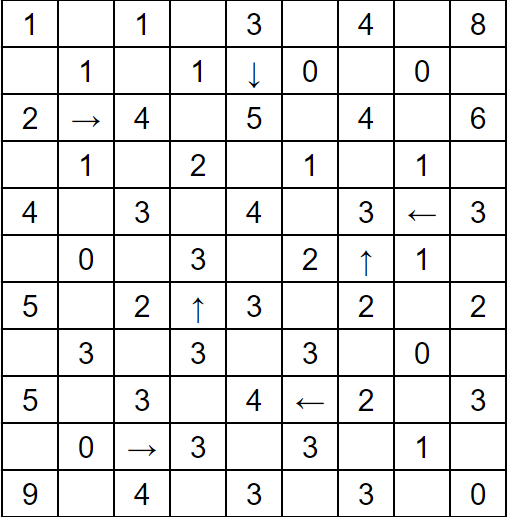

# Arrow Balancing Puzzles — Generator, Solver, and Validator

A simple engine for Arrow/Number Balancing puzzles (I'm still not sure of the name). Each numbered cell requires exactly that many **incoming arrows** from its row/column (pointing to the number).
Like every other project I've invested time into, I wrote this to challenge myself. In this case, I had trouble thinking of how to algorithmically solve the example below and decided to explore it further as a constraint satisfaction problem.


## Features
- **Robust solver** with propagation-first constraint satisfaction problem (CSP) and minimal backtracking
- **Validators** for starting puzzles versus filled boards and solutions
- **Fast generator** using random initialization and repair-based construction (always solvable)
- **Difficulty presets**: easy / medium / hard (size-aware defaults and clue proportion)
- **Optional uniqueness filter** to keep only single-solution puzzles (for eventual incorporation into Simon Tatham's puzzle suite after rewriting to C)
- **Simple I/O helpers** for saving/loading puzzle test sets of various sizes

## The Game


### Rules
- Goal: fill in the missing arrows so that the puzzle is balanced with the numbers shown.
- A grid cell is either a digit (number cell) or an arrow `N/E/S/W` (arrow cell) or `.` (hidden arrow in the puzzle state).
- An arrow contributes **+1** to every numbered cell in the direction it points along the row/column until the grid's edge (along its line of sight).
- The number of incoming arrows for each numbered cell must match its digit exactly, without going over or under.
- Arrows on the edge of the grid can't point towards the edge while contributing to no numbers
- Numbers are placed so that no two are at Manhattan distance 1 (checkerboard layout) away from each other.

## Quick start
```python
    from main import generate_puzzle
    from solver import solve_grid
    from utils import validate_solution_against_puzzle, pretty_print

    puzzle, hidden_solution = generate_puzzle(
        rows=11, cols=9,
        difficulty="medium",
        unique_only=False,
        seed=42,
    )

    solved = solve_grid(puzzle)
    ok, msg = validate_solution_against_puzzle(puzzle, solved)
    print("valid:", ok, msg)
    pretty_print(puzzle, render_arrows=False)
    pretty_print(solved)
```