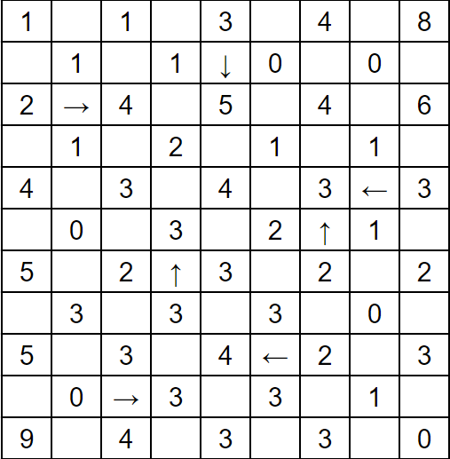

# Arrow Balancing Puzzles — Generator, Solver, and Validator

A simple engine for a family of Arrow Balancing puzzles that are functionally the same as the "Arrows" puzzles [shown here](https://puzzlegenius.org/arrows/). Each numbered cell requires exactly that many **incoming arrows** from its row/column (pointing to the number). Other rules are detailed below. The project is slowly being built on so that I may eventually make it a webapp or simple game GUI after getting the core functionality solid.

Like a lot of other projects I've invested time into, I wrote this while getting distracted from another task because the problem was more interesting. In this case, I had trouble thinking of how to solve the example below with dynamic programming (originally) and decided to explore it further as a constraint satisfaction problem.


## Features
- **Robust solver** with propagation-first constraint satisfaction problem (CSP) and minimal backtracking
- **Alternative solvers** using integer linear programming (ILP) formulation or a dynamic programming approach
- **Validators** for starting puzzles versus filled boards and solutions
- **Fast generator** using random initialization and repair-based construction (always solvable)
- **Difficulty presets**: easy / medium / hard (size-aware defaults and clue proportion)
- **Optional uniqueness filter** to keep only single-solution puzzles (for eventual incorporation into Simon Tatham's puzzle suite after rewriting to C)
- **Simple I/O helpers** for saving/loading puzzle test sets of various sizes

## The Game


### Rules
- Goal: fill in the missing arrows so that the puzzle is balanced with the numbers shown.
- A grid cell is either a digit (number cell) or an arrow `N/E/S/W` (arrow cell) or `.` (hidden arrow in the puzzle state).
- An arrow contributes **+1** to every numbered cell in the direction it points along the row/column until the grid's edge (along its line of sight).
- The number of incoming arrows for each numbered cell must match its digit exactly, without going over or under.
- Arrows on the edge of the grid can't point towards the edge while contributing to no numbers
- Numbers are placed so that no two are at Manhattan distance 1 (checkerboard layout) away from each other.

## Installation
Currently, there aren't any hard dependencies for the project, but the addition of the Integer Linear Programming (ILP) solvers includes a dependency on `PuLP`.
To use either `ILPNumberedPuzzleSolver` or `ILPArrowsOnlyPuzzleSolver`, run the following with pip first:
```python
python -m pip install pulp
```
Then you can use either class or (not yet implemented) the appropriate flags to use it within the code, with a fallback to use the default CSP solver instead.


## Quick start

> WARNING: subject to change in the near future

```python
    from main import generate_puzzle
    from solver import solve_grid
    from utils import validate_solution_against_puzzle, pretty_print

    puzzle, hidden_solution = generate_puzzle(
        rows=11,
        cols=9,
        difficulty="medium",
        unique_only=False,
        seed=42,
    )

    solved = solve_grid(puzzle)
    ok, msg = validate_solution_against_puzzle(puzzle, solved)
    print("valid:", ok, msg)
    pretty_print(puzzle, render_arrows=False)
    pretty_print(solved)
```


## Road Map
- [ ] (SHORT TERM) consider encapsulating more aspects of the puzzle like grid state, game state, etc and make more higher-order functions to update these
- [ ] (SHORT TERM) write an abstract factory for solvers to read settings and perform game solver/generator initialization
- [ ] (SHORT TERM) add parser to handle game settings and dataclasses to encapsulate them - should be flexible enough to instantiate with input from a GUI
- [ ] complete rendering engine to render and save/display grid with arrows for a "printable" format (current SVG rendering script is a rough draft generated by LLM)
- [ ] create a simple GUI for playing the game interactively in its own window (needs to be extensible enough to work in a webapp, so maybe consider Dash or Gradio?)
- [ ] introduce a lightweight Streamlit (or some other appropriate framework) app for generating and solving online using the GUI backend
- [ ] (LONG TERM) in next version, allow for diagonal or circular (arrows pointing off grid) arrow puzzles like some similar puzzles seen online
- [ ] Rewrite the most computationally-intensive code for generating puzzles in C++ or Java (if handling via microservices for a webapp) - might just try rewriting some things with `numpy` first
